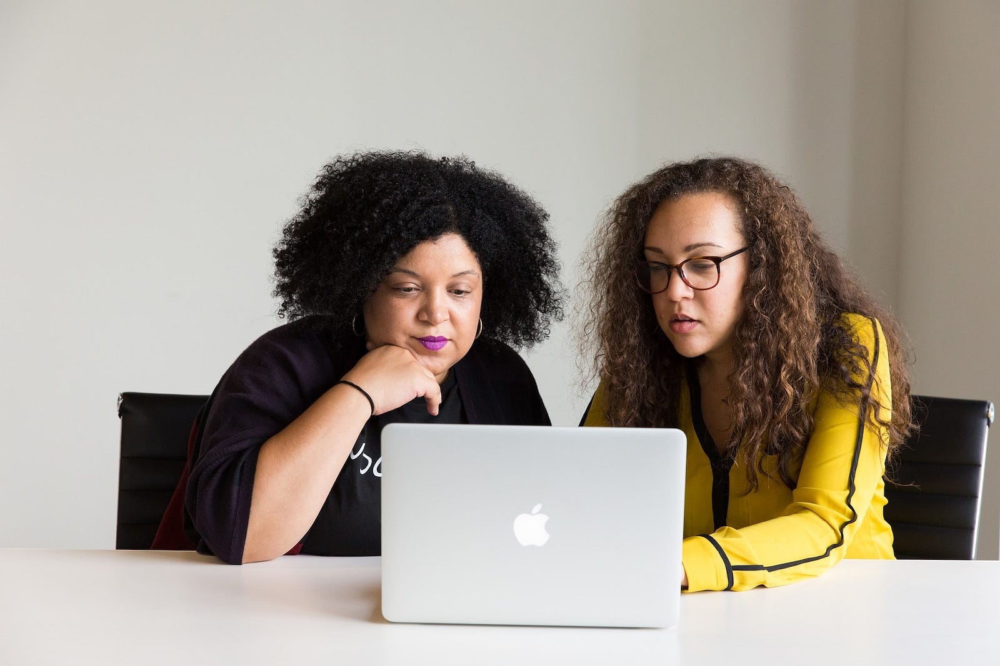

<figure>

<figcaption>

Photo by [Christina @ wocintechchat.com](https://unsplash.com/@wocintechchat?utm_source=unsplash&utm_medium=referral&utm_content=creditCopyText) on [Unsplash](https://unsplash.com/photos/uSL0rdRY-Uw?utm_source=unsplash&utm_medium=referral&utm_content=creditCopyText)

</figcaption>

</figure>

Recently, I’ve made the difficult decision to stop doing live-coding interviews. These interviews are prevalent in the tech industry, but after years of completing several different types of live-coding interviews for front-end and full-stack roles, I’ve finally decided to stop.

Now that I’m a freelance engineer, I have a lot of flexibility in terms of my day-to-day coding. Typically, I’ll code small side projects as inspiration strikes. For a client project, I might start working in the middle of the night or I’ll work on a small ticket for an hour or two throughout the day.

I’ve found that much of my time coding is spent…not coding. I might decide to take a break and go for a walk. I might take a nap while trying to solve a problem. I might be in the middle of making dinner and suddenly find myself thinking of a new way to approach the same problem. I might discuss the problem out loud or [rubber duck](https://en.wikipedia.org/wiki/Rubber_duck_debugging) the problem by bouncing ideas off of others. I might do an online search to understand how people have solved similar problems in the past. I might do any number of these things — all before writing one line of code. I would rather contemplate how to implement a potential solution and eliminate specific edge cases than immediately begin coding. From what I’ve heard from other engineers, this is pretty standard.

However, with interviews I’ve found that it’s virtually impossible to think through problems this way. Instead, you need to think of a solution to the code challenge and begin coding right away.

But what if your brain works differently?

* * *

In my own experience, I’ve found that my thought process doesn’t align well with live-coding interviews. When I was a kid, I could complete math problems but not articulate how I had solved them. Eventually, I learned how to explain my thought process to other people, but I’ve found that this initial experience translates to my live-coding technical interviews. Sometimes my brain will make connections and come to conclusions faster than I can articulate, so an interviewer might assume that I don’t know the answer or am doing things without thinking when that’s not the case. I oftentimes draw conclusions and make connections in ways that my interviewers do not, so they assume that I’m guessing answers that I already know. Occasionally my thoughts get jumbled and it’s hard to untangle them; it’s easy to lose my train of thought entirely. It can take me extra time to process what someone else has said. At times, I’ll read through a coding problem and my brain will have difficulty comprehending it, so I might struggle to understand what is being asked of me in the first place despite being capable of solving the problem. It can be hard for me to keep different things in mind while trying to work on a problem — I might think of one edge case, but the second edge case feels slippery, attempting to wiggle just out of my grasp as I try to focus on it.

<figure>

<figcaption>

Photo by [Christina @ wocintechchat.com](https://unsplash.com/@wocintechchat?utm_source=unsplash&utm_medium=referral&utm_content=creditCopyText) on [Unsplash](https://unsplash.com/photos/IxmHiUC-yOw?utm_source=unsplash&utm_medium=referral&utm_content=creditCopyText)

</figcaption>

</figure>

My experience isn’t unusual. I’ve seen other engineers have similar problems with live-coding interviews. This is understandable since live-coding interviews can often be discriminatory and usually [they’re measuring skills other than a candidate’s coding ability](https://www.sciencedaily.com/releases/2020/07/200714101228.htm). In fact, one thing I’ve noticed is that many live-coding interviews are actually measuring a candidate’s context-switching ability, mental processing speed, and auditory processing skills.

What is context switching? It’s the brain’s ability to switch from one task to another. This is different from multi-tasking because multi-tasking focuses on doing multiple tasks concurrently. Context-switching (also called task-switching) is going from one task to another. For example, going from answering trivia questions about CSS to working with 2D arrays in JavaScript. There are several disabilities that can make it difficult for people to switch from one task to another. Just a few are autism, ADHD, and depression, but it can also be temporary — [you can struggle with context-switching simply because you are sleep-deprived](https://pubmed.ncbi.nlm.nih.gov/19878450/). These candidates will be at a disadvantage because, the longer the interview goes on and the more context switching is required, the worse their skills will seem. In reality, if they’d only been given an assignment that didn’t require as much context-switching, they would have excelled. Unfortunately, some popular third-party technical interview companies have created interviews where candidates are asked to answer several semi- or unrelated questions one after another, which will eliminate many candidates erroneously.

Another skill that is measured during these interviews is processing speed. This is how quickly your brain is able to understand information. In live-coding interviews, here is how this comes into play: you are handed a problem that you then need to understand, ask relevant questions about, determine a potential solution for, and then actually write and implement said solution successfully, all while verbalizing your thought process. Typical live-coding interviews are about an hour, so in that time frame you must complete all the steps above. Some of the same disabilities and temporary conditions that I mentioned above (autism, ADHD, sleep deprivation, etc.) can also result in difficulties with processing speed, in addition to other disabilities such as dyslexia. This is related to auditory processing as well.

Auditory processing is a person’s ability to understand and comprehend what they’re hearing as they’re hearing it. If you’ve ever met someone who says “what?” after you’re finished speaking and then, right as you begin to repeat yourself seems to understand you, they likely struggle with auditory processing. A broad range of people can have auditory processing disorder (APD), also called auditory dyslexia. As people with APD listen to the interviewer during an interview, they can struggle to understand what is being said, especially in such a high-stress situation. They may also struggle to hear the interviewer if there’s background noises or any distractions, which is not helped by the fact that not all interview platforms allow candidates to enable subtitles without alerting the interviewer — assuming they can enable subtitles at all.

<figure>

<figcaption>

Photo by [Elisa Ventur](https://unsplash.com/es/@elisa_ventur?utm_source=unsplash&utm_medium=referral&utm_content=creditCopyText) on [Unsplash](https://unsplash.com/photos/bmJAXAz6ads?utm_source=unsplash&utm_medium=referral&utm_content=creditCopyText)

</figcaption>

</figure>

This list doesn’t even take into account the other reasons people might struggle with live-coding technical interviews, such as difficulties with reading comprehension (are they dyslexic? is the interview in their second language?), difficulty with mathematics (do they have dyscalculia?), or even managing stereotype threat.

This begs the question — do we only want engineers who process everything quickly? Do we only want engineers who immediately understand everything that they hear without delay due to a disability? Do we only want engineers who can zip from task to task, even though the day-to-day work often requires honing in on a few tasks at a deeper level? Do we really want to eliminate any engineers who code slowly and thoughtfully?

Of course there will always be interruptions. Of course there will always be impromptu meetings. Of course something will break in production suddenly and need to be fixed. But that isn’t the same as an interview that condenses all of these experiences into the course of an hour, setting some people up to fail who would otherwise thrive.

As a freelance engineer, I’ve found that working with clients doesn’t require live-coding interviews. There may not be any coding interviews at all. Instead you talk with the client about their problems and how you might be able to meet their particular needs. You might write a proposal outlining a potential solution, and then go from there. If it turns out not to be a great fit, you or the client can end a contract or choose not to sign a new one. You can take the time that you need to be able to code thoughtfully and meticulously, rather than churning out solutions at rapid-fire pace.

This flexibility works a lot better for me — I’m able to focus on coding the ways that work for me, rather than trying to change my thought process to appeal to companies that likely don’t value it in the first place. I think the tech industry could learn a lot from these types of flexible interviews.

* * *

<figure>

<figcaption>

Photo by [Tachina Lee](https://unsplash.com/@chne_?utm_source=unsplash&utm_medium=referral&utm_content=creditCopyText) on [Unsplash](https://unsplash.com/photos/-wjk_SSqCE4?utm_source=unsplash&utm_medium=referral&utm_content=creditCopyText)

</figcaption>

</figure>

* * *

You may be a software engineer reading this and wondering — what are the alternatives? Do I really have a choice?

To which I’d say, yes, you have a choice. You can choose to interview with [companies that don’t require these types of interviews](https://github.com/poteto/hiring-without-whiteboards). You can interview with companies that offer flexibility in their interview process, with a choice of take home projects, live-coding exercises, or code reviews. If you’re someone who struggles with live-coding interviews, you can ask for alternatives. Maybe the more engineers begin demanding flexibility in this process, the more things will change, and the more inclusive technical interviewing will become.

* * *

Want more articles like this delivered straight to your inbox? Subscribe below!
