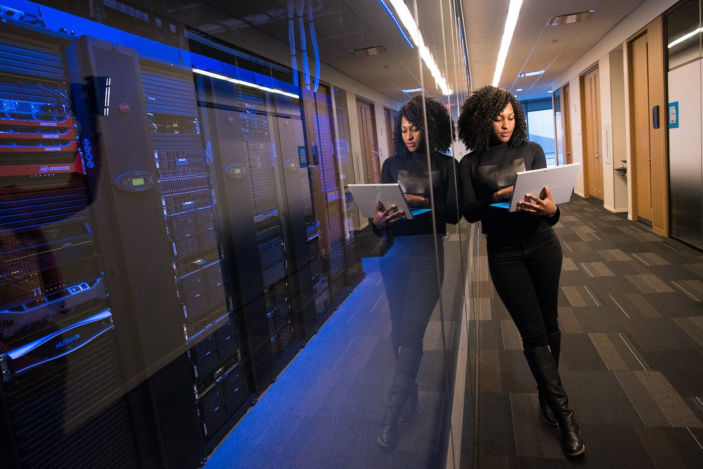

<figure>

<figcaption>

Photo by [Desola Lanre-Ologun](https://unsplash.com/@disruptxn?utm_source=unsplash&utm_medium=referral&utm_content=creditCopyText) on [Unsplash](https://unsplash.com/photos/IgUR1iX0mqM?utm_source=unsplash&utm_medium=referral&utm_content=creditCopyText)

</figcaption>

</figure>

“How do I break into tech?”

If you do a quick online search, there are lots of suggestions.

You could attend a coding bootcamp or certificate program, as I did.
You could attend a bootcamp to teach you how to pass technical interviews, especially those that involve data structures and algorithms.
You could go back to school for a bachelor’s degree in computer science. You could contribute to open source projects, network with other software engineers, sign up for a paid mentorship program, attend conferences and/or meetups, ask people in your network for referrals to open roles…the list goes on.

Unfortunately, this is the wrong question. What you should be asking is “How do I _stay_ in the tech industry?”

Don’t get me wrong — getting in is difficult, otherwise there would be little demand for the technical interview prep or coding bootcamp industries. In North America alone, the coding bootcamp industry is expected to generate $1,200 million in revenue by the year 2038, according to [a recent survey by SkyQuest Technology Consulting](https://finance.yahoo.com/news/coding-bootcamp-market-worth-2317-152100209.html). But at the end of the day, breaking into tech is something most people only do once. It’s finite. You find one opportunity, one company, one contract, steady work that pays and adds to your portfolio — and you’ve done it. You’ve “broken into” the tech industry.

However, staying in the tech industry is a much bigger challenge, and not enough people are talking about it.

[Half of all women in tech leave the industry by the time they turn 35.](https://www.accenture.com/_acnmedia/PDF-134/Accenture-A4-GWC-Report-Final1.pdf) According to the same study, [women leave tech almost at a 50% higher rate than men](https://www.accenture.com/_acnmedia/PDF-134/Accenture-A4-GWC-Report-Final1.pdf). This may be partly due to the gender wage gap in tech. [Women in tech consistently make less than their male counterparts](https://www.pewresearch.org/science/2021/04/01/stem-jobs-see-uneven-progress-in-increasing-gender-racial-and-ethnic-diversity/), but [the gap is even worse for Black and Latinx women in tech](https://www.pewresearch.org/science/2021/04/01/stem-jobs-see-uneven-progress-in-increasing-gender-racial-and-ethnic-diversity/). On top of that, [women in tech are less likely to be promoted than men](https://mitsloan.mit.edu/ideas-made-to-matter/women-are-less-likely-men-to-be-promoted-heres-one-reason-why) because, even when women are scored higher in terms of performance, they are scored lower than men in terms of potential. This matches [research in other industries](https://hbr.org/2021/04/how-one-company-worked-to-root-out-bias-from-performance-reviews) which shows that groups viewed as inherently less competent (women, disabled people, people of color, queer people, etc.) are judged on their _performance_, whereas white men are judged on their _potential_.

\*\*\*

For people of color, particularly women of color, the stats are even more dire. [According to a study by the Kapor Center for Social Impact](https://www.kaporcenter.org/wp-content/uploads/2017/08/TechLeavers2017.pdf) that surveyed those who had ever left a tech job, almost a quarter of the underrepresented people of color surveyed had dealt with stereotyping at work. Although a [McKinsey Institute for Black Economic Mobility report](https://fortune.com/2023/02/27/black-tech-talent-gap-job/) from earlier this year projected that the number of tech jobs will grow 14% by 2032, the amount of black talent in tech is only expected to increase by 8 percent. Jan Shelley, a coauthor of the report, points out that this may be due to companies investing in black entry-level talent without doing enough to support their existing middle-level employees. Not to mention how [the recent tech layoffs have set back diversity and inclusion goals at many tech companies](https://www.reuters.com/business/sustainable-business/big-tech-layoffs-may-further-disrupt-equity-diversity-efforts-2023-01-05/). In fact, [many black women are leaving corporate America altogether and choosing to start their own businesses](https://www.businessinsider.com/black-women-leaving-corporate-america-entreprenurship-startups-2022-12).

<figure>

<figcaption>

Photo by [Christina @ wocintechchat.com](https://unsplash.com/@wocintechchat?utm_source=unsplash&utm_medium=referral&utm_content=creditCopyText) on [Unsplash](https://unsplash.com/photos/glRqyWJgUeY?utm_source=unsplash&utm_medium=referral&utm_content=creditCopyText)

</figcaption>

</figure>

There are significant challenges for disabled engineers as well. [In this article](https://www.linkedin.com/pulse/interview-practices-questions-can-easily-exclude-talent-alex-kelly/), engineering manager Alex Kelly outlines how technical interviews can exclude neurodiverse candidates — which means that even if a neurodivergent engineer breaks into tech, they might find themselves unable to stay in the industry if they struggle with technical interviews that are by nature inaccessible. On that note, a study found that [technical interviews accurately assess a candidate’s performance anxiety, not overall coding competency](https://www.sciencedaily.com/releases/2020/07/200714101228.htm). It’s worth noting that all of the women in the study who completed a traditional coding interview instead of a skills-focused interview actually failed.

Then there’s the lack of diversity at certain companies leading to products that don’t match the needs of their customer base. [Beauty filters that aren’t designed for people of color](https://mashable.com/article/tiktok-glow-look-filter). [Discriminatory autocomplete suggestions on popular online search engines](https://www.wired.com/story/google-autocomplete-vile-suggestions/). Apps that don’t account for the harassment many women deal with online. [Companies using artificial intelligence as an excuse not to hire people of color](https://www.theverge.com/2023/3/27/23658385/levis-ai-generated-clothing-model-diversity-denim). [AI that relies on datasets that are biased according to gender and race.](https://uxdesign.cc/midjourney-is-incredible-but-you-can-see-there-are-definite-existing-biases-in-its-dataset-4b1131fb0533) It can be difficult to stay in an industry where, at times, you can clearly see how a particular product has a negative impact on people like you, and the desire to change this sometimes just isn’t there.

How do you stay in an industry that doesn’t always want you there?

“Now what?” you might be wondering.

You might have just graduated with a CS degree. Maybe you’re halfway through a coding or technical interview bootcamp. Maybe you’ve only just managed to create a web page that says “Hello, World!” for the first time. Maybe you’re still wondering if you could really learn how to code and become a software engineer.

Or maybe you’ve already made it. Maybe you’re sitting at home during your lunch break googling “when to quit a job with nothing lined up.” Maybe you’ve just been laid off. Maybe you were thinking about quitting, but the threat of tech layoffs at your company is keeping you there. Maybe you’re a woman, person of color, or disabled person, or all three, and you’ve experienced the issues I mentioned above.

Although women, underrepresented people of color, disabled people, and other marginalized groups are being encouraged to enter the tech industry, they’re not being adequately prepared for the difficulties that they’ll face once in the industry. Rather than pushing them out of the plane without a parachute, we should be giving them the tools to navigate once they land.

<figure>

<figcaption>

Photo by [Brooke Cagle](https://unsplash.com/@brookecagle?utm_source=unsplash&utm_medium=referral&utm_content=creditCopyText) on [Unsplash](https://unsplash.com/photos/g1Kr4Ozfoac?utm_source=unsplash&utm_medium=referral&utm_content=creditCopyText)

</figcaption>

</figure>

**The best way to stay in tech is to determine what this journey will look like for you and make steps toward that every day.** For some people, that means taking sabbaticals. For others, it’s joining the FIRE (Financial Independence, Retire Early) movement and planning to retire early. It might be building or joining a community of other software engineers from similar backgrounds who can provide both practical and emotional support. Some people might enjoy working a few contract jobs a year and then planning for time off in-between.

For myself, the current answer is freelancing. I like being able to work on a wide variety of projects that push me to learn all sorts of new things. I like working a flexible schedule - it doesn’t matter if I work at 11 am or 11 pm so long as the work gets done. I have the bandwidth to code in my free time and learn new technologies, just for fun. (Mythic software engineers seem to love working on personal projects, but most software engineers I know are too tired after staring at code all day to even think about it.) I enjoy not experiencing microaggressions on a daily basis. I can live anywhere and work where I’m most productive. The possibilities are endless.

My hope is that software engineers begin feeling more empowered and emboldened to choose a career path that works for them, even if it’s non-traditional. We can move away from the idea of breaking into tech and instead support engineers as they mold their careers to match the lives they imagine for themselves, whatever that may be.

* * *

Want more articles like this delivered straight to your inbox? Subscribe below!
