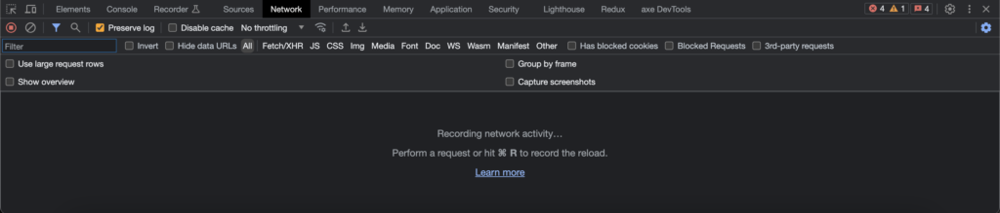
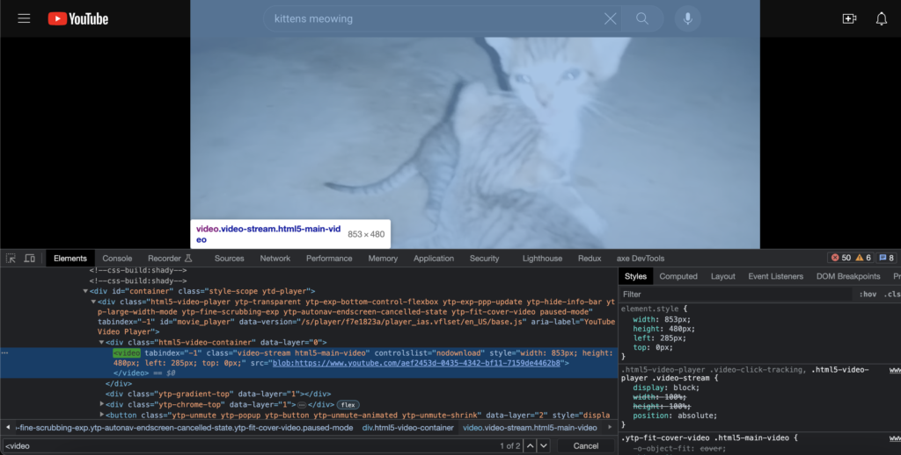

I've seen many people online struggling to watch videos that don't offer speed controls or an option for their preferred video speed, so I decided to make this tutorial. This method works for videos using the [video](https://developer.mozilla.org/en-US/docs/Web/HTML/Element/video) tag and doesn't require any external tools or browser extensions. You can also go through the same steps for any [audio](https://developer.mozilla.org/en-US/docs/Web/HTML/Element/audio) elements to increase or decrease audio speed.

First, you can navigate to any web page that has a single video.

Next, we're going to open the developer tools for your browser. You can right-click on the page and then click "inspect" in the dropdown menu that opens. On a Mac, you can click `command + option + i`. You should see something similar to the below.

From there, you can select the inspector tool to the far upper left. Once you've selected this tool, you'll have the option to select any HTML element on the page. You can click the video itself to locate the `<video>` tag in the document, which should open up the Elements section. Alternatively, you can click on the "Elements" tab at the top of the dev tools window, then use `command + f` or the search bar to search for some variation of `<video>`.

Below is an example of what you might see - the `<video>` element in the HTML is highlighted, as well as that element on the Youtube video itself.

At this point, we're ready to write some code. You can click on the Console tab at the top of the dev tools window. In the console, you can input the following:
`document.querySelector('video').playbackRate = 1.75`;

This code snippet will grab the first video element in the document and adjust the video's [playback rate property](https://developer.mozilla.org/en-US/docs/Web/API/HTMLMediaElement/playbackRate), which determines the speed. The normal speed is 1.0; anything lower than that will decrease the speed, while a higher number will increase the speed. In this case, the code snippet will adjust the speed to 1.75, but you can replace this number with your preferred speed.

If you execute this code on a webpage that doesn't have a video element or on a page in which the video element is nested within an iframe, you might see this error message. In the latter case, you should select the video in the DOM first before trying to execute the code - this way the code can locate the HTML element within the iframe before trying to adjust the playback rate.

If the speed has been updated successfully, you should see a message in the console indicating the new speed. You can confirm by running `document.querySelector('video').playbackRate` and verifying that it matches the new rate. When you click play on the video, you should also notice that the speed has been updated.

Now you have the power to update the speed on any web page, even if the video controls are missing or your speed is not available. Happy coding!

* * *

Want more articles like this delivered straight to your inbox? Subscribe below!
