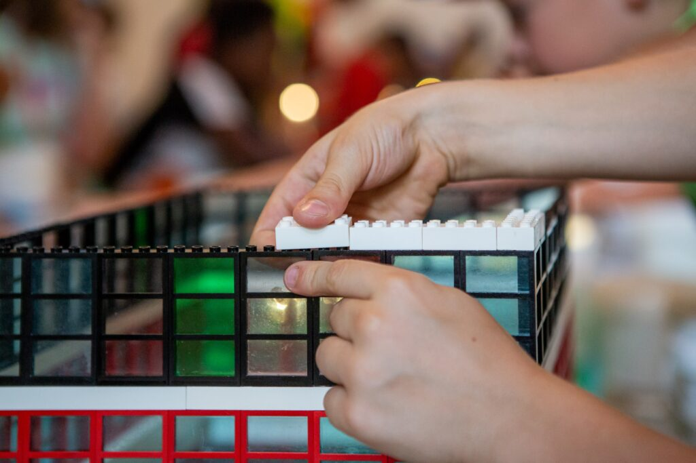

<figure>

<figcaption>

Photo by [Astrid Schaffner](https://unsplash.com/@familyschaffner?utm_content=creditCopyText&utm_medium=referral&utm_source=unsplash) on [Unsplash](https://unsplash.com/photos/close-up-of-hands-holding-a-device-zYsdzdspkBQ?utm_content=creditCopyText&utm_medium=referral&utm_source=unsplash)

</figcaption>

</figure>

Recently I've been interested in the idea of bootstrapping (creating a startup without outside funding) and building a Software as a Service (SaaS) product. I've been inspired by other SaaS products that I've used in the past that were built by engineers, such as [Key Values](https://www.keyvalues.com/) and [750 Words](https://www.750words.com/).

Lately it seems like tech products are always trying to expand and become bigger, but not necessarily better. I like that these two products are straightforward and simple. They do exactly what they say they'll do. I've been thinking more and more about building my own.

It's easy to build a product for months or even years, only to find out that the demand isn't there. I would rather build in public and connect with an audience early on. That way, if that connection doesn't happen I can move on and try the next thing. I've been a student of [30x500](https://30x500.com/academy/) for several months and have been learning how to apply its teachings to create online products. Another resource I've used is the [Startups for the Rest of Us](https://www.startupsfortherestofus.com/) podcast. The [Indie Hackers](https://www.indiehackers.com/) community and podcast have been a great help as well.

As a result, I wanted to announce my site, [NomadicPets](http://nomadicpets.com). I'm a digital nomad and have been traveling internationally with my pet for several months. I noticed that in many digital nomad spaces there were few pet owners, even though having a pet can severely limit your travel opportunities. I created a [NomadicPets directory](http://nomadicpets.com/directory) to showcase the import and export requirements for various countries to help digital nomads with pets make informed decisions about international pet travel, whether that means taking their pet abroad, leaving them at home, or rehoming them. In the future, I plan to write blog posts about traveling with pets and answer common questions.

What could you build today?

* * *

Want more articles like this delivered straight to your inbox? Subscribe below!
