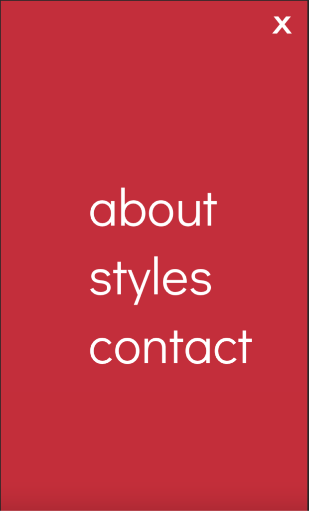

<figure>


<figcaption>

Photo by [Firmbee.com](https://unsplash.com/@firmbee?utm_content=creditCopyText&utm_medium=referral&utm_source=unsplash) on [Unsplash](https://unsplash.com/photos/macbook-pro-beside-ipad-and-iphone-turned-on-2mc2B5iX6as?utm_content=creditCopyText&utm_medium=referral&utm_source=unsplash)

</figcaption>

</figure>

For the past three years, I've occasionally worked on a personal project that started out as a bootcamp project. [loc collective](https://decembergarnetsmith.com/code#loc-collective) queries the Yelp API to search for locticians in various cities across the United States based on loc type. I built the site using React, and I regularly update this project out of necessity because I use it personally. I also send the link online to others who may need it, and since the site is search indexed, it appears in search results. As a result, I've made several changes over the years, including the following:

- converting class components to functional components

- building an API using Node to convert the front-end project to a full-stack one (and hide the project's API key)

- updating tests on the front-end and adding tests for the back-end

- adding a loading spinner using CSS

- splitting one reusable component into several distinct components

- deploying the backend continuously via Heroku and then Render after Heroku eliminated its free tier

But the biggest change I've always wanted to make was making the site responsive. Since it started as a bootcamp project and at the time, I had not yet learned about mobile responsiveness, I didn't implement it originally. It was on my list of issues to fix. However, that task soon became an issue in and of itself.

Originally, I planned to use Tailwind. I knew that in order to do so, I would need to create additional mobile and tablet designs using Figma. Then, I would need to build additional components that would be displayed depending on the resolution of a user's device, [as outlined in Tailwind's docs](https://tailwindcss.com/docs/responsive-design). I would probably need a separate mobile header, a mobile header modal, and different mobile, tablet, and desktop components for at least the home page of the website since that had the most complex display.

I knew exactly how to do this - I had worked a full-time job that used Tailwind and was very familiar with using it for responsive design. But it just seemed so cumbersome to create all of these different components, especially since I knew I wouldn't learn anything new from the experience. In March of this year, I created separate mobile and tablet Figma designs. Despite this, I couldn't find the time or motivation to actually implement them.

I've mentioned before that I learned over the summer how to build browser extensions using vanilla JavaScript, HTML, and CSS. Doing so made me rethink my relationship with front-end tech that I had taken for granted such as JavaScript frameworks and CSS utility frameworks. I especially learned just how much you can do with CSS; I built applications to hide ads and various other distracting elements on multiple sites mainly with CSS. Some of the CSS that I used wasn't even an option with Tailwind. Based on that experience, I started to wonder: would it be easier to build a responsive website using CSS instead of Tailwind?

I decided to implement responsiveness using [media queries](https://developer.mozilla.org/en-US/docs/Web/CSS/CSS_media_queries), which allow you to override the CSS at specific breakpoints that are based on the viewport size of different devices. Since I was using flexbox for much of the application, creating a mobile responsive design became simple.

This code

```
display: flex;
```

in a lot of cases simply became

```
display: flex;
flex-direction: column;
```

at different breakpoints within a media query.

(Since `flex-direction: row` is the default, there's no need to write it in the first example.)

In addition to media queries, I also created one new component for a modal that appears when you click on the hamburger menu in the mobile header.

<figure>



<figcaption>

A screenshot of the loc collective website that links to the pages about, styles, and contact. There's an x in the upper-right hand corner to close the modal.

</figcaption>

</figure>

And that was all! For three years, I had delayed making the website responsive. But after opting to use media queries and native CSS instead of Tailwind, I was able to implement responsiveness in just a few hours.

The best approach to responsiveness is going to vary from project to project, and there are [other ways of implementing responsive web design besides media queries](https://css-tricks.com/beyond-media-queries-using-newer-html-css-features-for-responsive-designs/). CSS happens to be the best approach for this particular codebase. But it's important to realize that a CSS utility framework like Tailwind isn't automatically the best option. Sometimes it's better to get back to basics with good ol' CSS.

* * *

Want more articles like this delivered straight to your inbox? Subscribe below!
