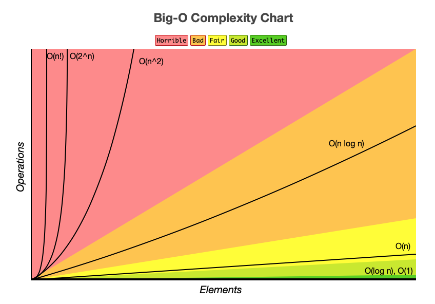

<figure>


<figcaption>

Photo by [Mike van den Bos](https://unsplash.com/@mike_van_den_bos?utm_content=creditCopyText&utm_medium=referral&utm_source=unsplash) on [Unsplash](https://unsplash.com/photos/text-jf1EomjlQi0?utm_content=creditCopyText&utm_medium=referral&utm_source=unsplash)

</figcaption>

</figure>

When people talk about front-end web performance, traditionally they will mention bundlers, lazy loading, server-side rendering. However, data structures and algorithms can be crucial for ensuring optimal web performance. I learned this the hard way while working on a freelance project that involved working with a legacy codebase.

The codebase compared multiple CSV files to find any matches across files. The user would upload two CSV files, and the application would compare both files and eliminate any entries that appeared on both lists. For the remaining entries, it would add additional information for any entries with matches in a database.

For simplicity's sake, let's say that the application worked with hospital administration data. Staff at one hospital might upload two spreadsheets - one with a list of patients at Hospital A and another with patients at Hospital B. Any patients who have visited both hospitals (thus appearing in both lists) might be eliminated. Then, the user might search a statewide database to find any patients who had visited other hospitals in the state and update their patient information accordingly. As you might expect, the application handled a lot of data. In this article, I'm only going to focus on the portion of the application that would find patients from Hospital A who had also been to Hospital B.

Once uploaded, each CSV file was converted into an array of objects (`patientsA`Data and `patientsB`Data). Since the user uploading the patient data works for Hospital A, we would need to look at every single patient in Hospital A to see if there were matches in Hospital B. (The reverse would not be the case.)

The legacy code used a nested `forEach` loop to match patients in both datasets. There were two issues with this:

- there's no way to [break](https://developer.mozilla.org/en-US/docs/Web/JavaScript/Reference/Statements/break) out of or [continue](https://developer.mozilla.org/en-US/docs/Web/JavaScript/Reference/Statements/continue) in a `forEach` loop, so even if a patient match was found, that patient from Hospital A was still being compared against all other patients at Hospital B.

- the time complexity is `O(m*n)`, where `m` is the length of the Hospital A array and `n` is the length of the Hospital B array. This means that if there were 2500 patients in Hospital A and 2500 patients in Hospital B, the code would need to run 6,250,000 times just to finish the loop. As `m` and `n` increase, these numbers would just get higher.

Before I refactored this code, when I ran this application with updated patient data, it would crash the browser. I quickly realized it was because of the time complexity of the nested `forEach` loop. But how could I fix it?

I knew that I was limited by the fact that, no matter what, I would still need to loop through at least Hospital A's patient data. The time complexity would be at least `O(n)`. Would binary search be a possible solution?

Let's say that for every index in `patientsAData`, I used binary search to find the corresponding index in `patientsBData.` This is assuming that the second array is in alphabetical order. The time complexity of that would be `O(n) * O(log n)`, which would simplify to `O(n log n)`...which is also not an optimal time complexity.

<figure>



<figcaption>

[Eric Rowell](https://commons.wikimedia.org/wiki/File:Big-O_Cheatsheet.png), Public domain, via Wikimedia Commons

</figcaption>

</figure>

At this point, I wasn't sure what approach to take that would have a better time complexity than `O(n log n)`. I didn't want to settle on that as a solution before considering other options. I posted to a Slack community, where [aredridel](https://github.com/aredridel) pointed me in the direction of using a two-pointer solution, which I then spent some time researching before implementing in the codebase.

Basically, the two-pointer algorithm allows you to iterate through two sets of data once. You create pointers for both sets of data and increment/decrement them when certain conditions are met. Since it's one iteration, the time complexity is `O(n)`. In order for it to work, I uploaded both lists sorted alphabetically by last names. Let's say that the `patientsAData` and `patientsBData` arrays contained the following code:

```
const patientsAData = [{name: "Adams, Amy", age: null}, {name: "Banner, Bruce", age: 20}]
const patientsBData = [{name: "Banner, Bruce", age: 20}, {name: "Calvin, Klein", age: 45}]
```

In this case, the two-pointer technique would start with two pointers (`pointerA` and `pointerB`) set to 0. It would look at `patientsAData[pointerA]` (`patientsAData[0]`) and see "Adams, Amy." It would then look at `patientsBData[pointerB]` (`patientsBData[0]`) and see "Banner, Bruce." In alphabetical order, "Adams, Amy" will always come before "Banner, Bruce." Since both elements are the zeroth elements of each array, this must mean that `patientsBData` doesn't contain an "Adams, Amy," so we can safely increment `pointerA` to 1 and move to the next item in `patientsAData` compared to `patientsB[pointerB]` where `pointerB` is still 0.

The time complexity of this technique is `O(n),` which is better than both the original `O(n^2)` and the other solution I considered, `O(n log n)`. When I ran the application with the new code, instead of crashing when the length of the `patientsAData` array was 14,000 indices and the length of `patientsBData` was 21,000, it ran smoothly.

Without knowledge of algorithms, it would have been difficult to impossible to scale this front-end to work with larger data sets. Clearly data structures and algorithms are crucial to web performance. When striving to improve web performance on a front-end application, don't forget to start with the code.

* * *

Want more articles like this delivered straight to your inbox? Subscribe below!
