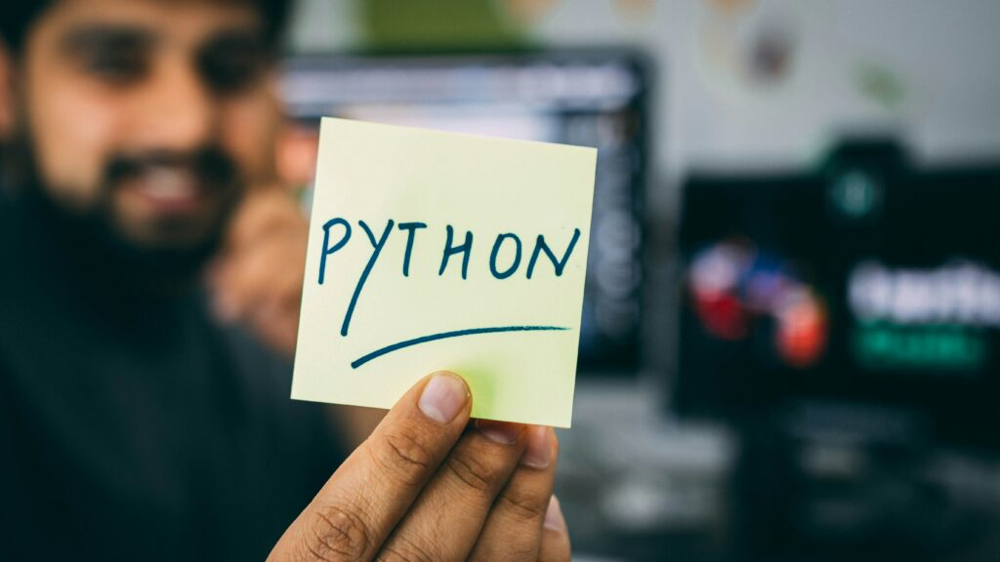

<figure>

<figcaption>

Photo by [Hitesh Choudhary](https://unsplash.com/@hiteshchoudhary?utm_content=creditCopyText&utm_medium=referral&utm_source=unsplash) on [Unsplash](https://unsplash.com/photos/person-holding-sticky-note-D9Zow2REm8U?utm_content=creditCopyText&utm_medium=referral&utm_source=unsplash)

</figcaption>

</figure>

Recently I’ve started learning Python, and I wanted to take some time to document my experience doing so as a developer with a background in JavaScript. The perfect place to start seemed to be answering the question “why?”

### why learn another programming language?

I decided to learn another programming language to deepen my knowledge of data structures and algorithms (DSA). After my experience [optimizing web performance using the two-pointer technique](https://decembergarnetsmith.com/2023/12/04/adventures-in-freelancing-data-structures-and-algorithms-on-the-front-end/), I realized that I wanted to have a stronger foundation in this topic beyond interview preparation. In the past, I’ve had a difficult time studying DSA because traditional coding exercises or Leetcode problems did not provide enough context for me. Most of the courses and books I used would summarize an algorithm and then immediately jump into a coding exercise, but I always wanted more information. When would I ever use this algorithm or that data structure? Why should I use one option versus another? What were some real-world scenarios in which using the data structure or algorithm in question might be necessary?

### why not javascript?

I have used JavaScript to study data structures and algorithms in the past, and I implemented the aforementioned two-pointer technique in JavaScript. However, I’d like to broaden my knowledge of programming overall and picking up an additional programming language seemed like a great way to do so.

### why python?

Once I started looking into more resources that taught data structures and algorithms outside of the context of technical interview prep, I noticed that most of them used Python. There were a few other reasons why I chose Python. It seemed easy to read coming from JavaScript, and when I asked other developers for their opinions, they suggested that it might be easier to learn than other languages. Personally I had more resources at my disposal to learn Python - I already owned several books and had access to more courses in the programming language than say, C++. I also have an interest in video game modding and some popular video games use Python for scripting, so I liked the idea of learning a programming language that I might be able to use when coding as a hobby as well. Python also seems to be a popular choice for automation and AI, which piqued my interest, too.

### what’s next?

In the coming weeks, I hope to detail my experience studying data structures and then (separately) algorithms using Python. I also hope to complete Harvard University’s online [Introduction to Programming with Python course](https://www.youtube.com/watch?v=nLRL_NcnK-4).

Which language do you think is best for studying data structures and algorithms and why?

* * *

Recently I've started learning Python, and I wanted to take some time to document my experience doing so as a developer with a background in JavaScript. The perfect place to start seemed to be answering the question "why?" I decided to learn another programming language to deepen my knowledge of data structures and algorithms (DSA). After my experience [optimizing web performance using the two-pointer technique](https://decembergarnetsmith.com/2023/12/04/adventures-in-freelancing-data-structures-and-algorithms-on-the-front-end/), I realized that I wanted to have a stronger foundation in this topic beyond interview preparation.

Want to follow my journey studying data structures and algorithms with Python as a JavaScript developer? Subscribe below!
