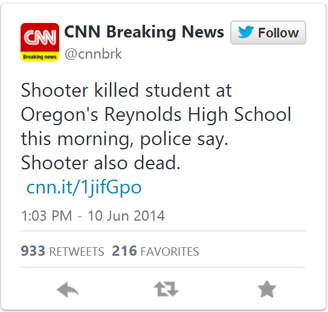
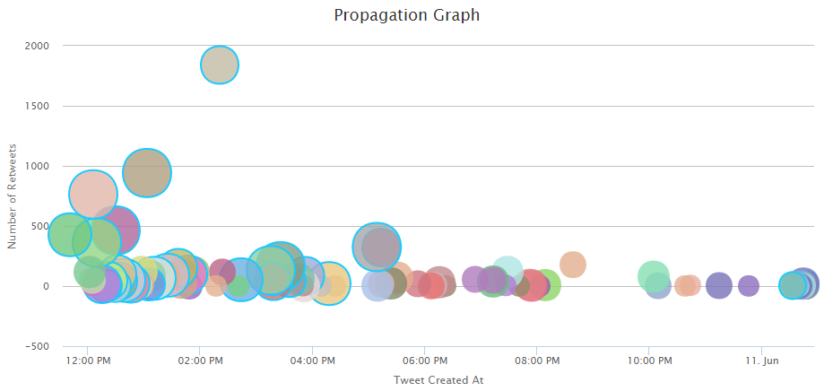
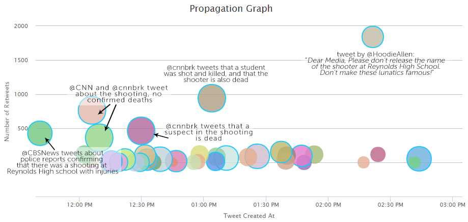
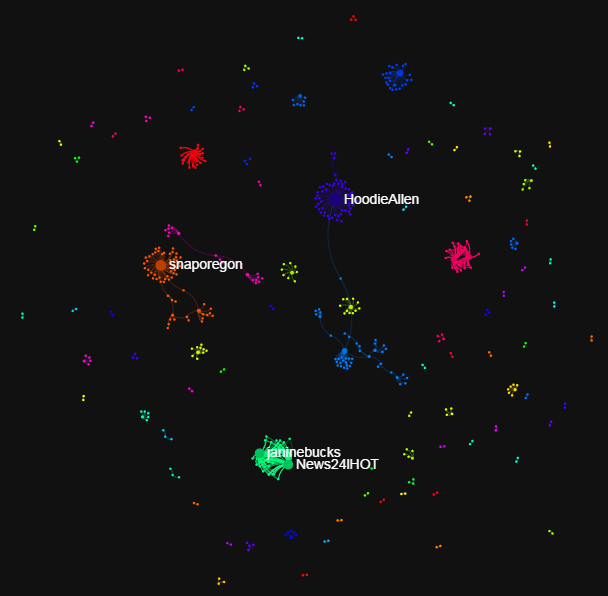
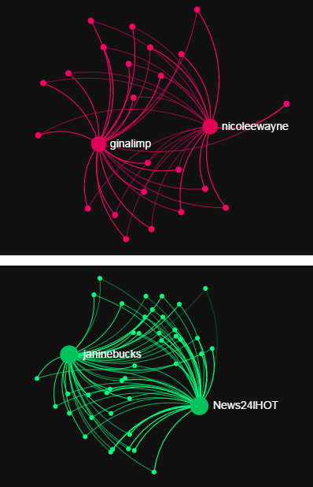
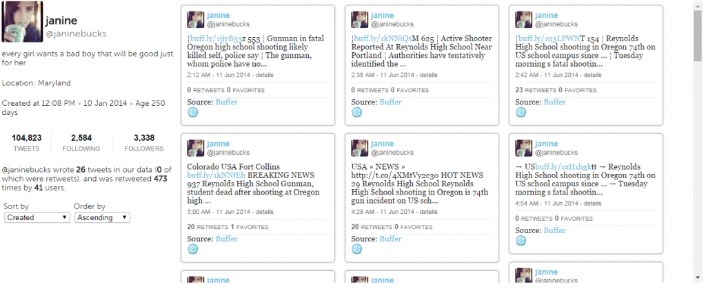
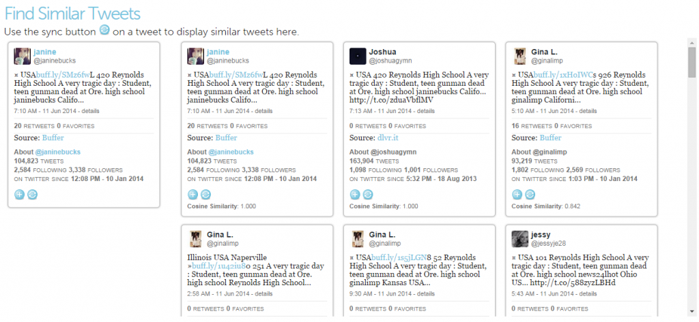
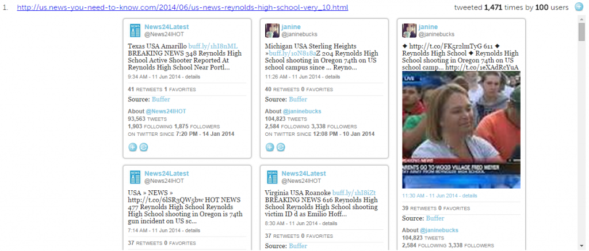
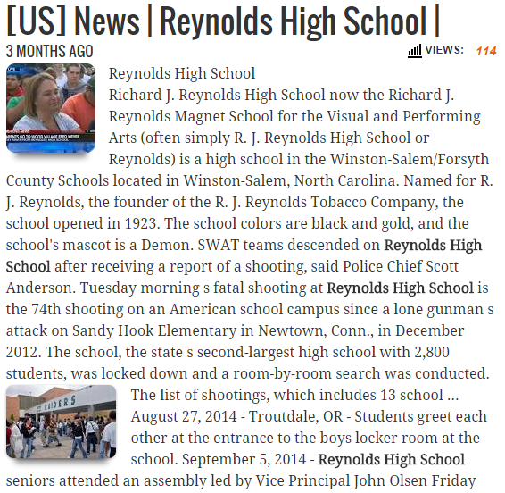

_Originally published September 17, 2014._

To describe how the Trails system works, we will go over the propagation of a recent story:

On June 10, 2014, [@cnnbrk](https://twitter.com/cnnbrk/) posted the tweet shown below, reporting a shooting in an Oregon high school.

Coming from a source like CNN (and a verified Twitter account), we expect this story to be true.  We will use the Trails tool to investigate it further: possibly, to back up our assumption that it is true, and also to see how it spread on Twitter and which users influenced the discussion.

[Explore this story with the Trails system!](http://twittertrails.wellesley.edu/~trails/stories/investigate.php?id=1746574)

### **Data Collection**

To learn more about how this story propagated, we began a data collection using Twitter's Search API the next morning, on June 11 at 11:47AM, using the following search terms: _oregon_, _high school_, _reynolds high school_, and _school shooting_.  After collecting about 14,000 tweets, we need to filter them to find only tweets which are relevant to the story we are investigating.  Trails provides an interface to do this, in which the user can select certain "required," "optional" and "excluded" keywords or phrases, as well as set various parameters to control how Trails will use these keywords.

As required keywords we chose _reynolds_ (the name of the high school) and _oregon high school_ .  At least one of the required keywords must appear in a tweet for it to be considered relevant (this can be changed to require all keywords, which we don't do in this case).  We also set two optional keywords: _shoot_ and _gun_.  Note that these keywords will also match terms like _shooting_ and _shooter_, or _gunman_.  These optional keywords may or may not appear in the text, controlled by a threshold value: for this story, we set the threshold value to _1_, meaning that at least one of the optional keywords must appear for a tweet to be relevant.

Out of the 14,000 original search tweets, the Trails system has used our inputs to select a total of _3,686_ relevant tweets.  Then, Trails creates a variety of visualizations through which we can explore this data.  In this post we feature five of these visualizations: the **propagation graph**, the **retweet network**, the **tweeted link bibliography**, the **user search** and the **similar tweet search**.

### Propagation Graph

The first visualization we'll discuss is the **Propagation Graph**.  It shows the tweets which were posted around the time the story first broke on Twitter.  Each point on the graph represents a tweet, and information about the tweet is measured in five ways: position on the x-axis is _time_ the tweet was posted, position on the y-axis is the _number of retweets_, the size of the point represents the _number of followers_ the user who tweeted has, the color measures _independence of content_ (points with the same color are tweets with highly similar messages) and whether or not the point has a blue border shows whether the user is _verified_.

<figure>

<figcaption>

The propagation graph shows the tweets that were posted when this story first broke on Twitter.

</figcaption>

</figure>

We can discover a few things looking at the graph overall:

- The story first breaks around 11 AM on June 10th, with a lot of activity from verified accounts over the next few hours

- Many verified accounts (points with blue borders) have tweeted about the shooting

- Also, many accounts with a large number of followers have been tweeting about this story, shown by the many large points

- The variety of colors of points shows that the content of the tweets is varied in language (many points of the same color tend to suggest many almost identical tweets)

But on the Trails system, this visualization is interactive: we can zoom in and study the tweets in the graph.   There is a lot of activity in the first 3-4 hours after this story breaks, so we will zoom into that area and take a look at the tweets which were written in that period:

<figure>

<figcaption>

A zoomed in view of the propagation graph, ranging from 11am to 3am on June 10th, 2014.

</figcaption>

</figure>

@CBSNews, @CNN and @cnnbrk have received the most attention during this time period, with five tweets that give us a good idea about how the story progressed.  @CBSNews breaks the story at 11:40 am, after police in Troutdale, Oregon confirm that there was a shooting at Reynolds High School, and that there were injuries.  About 25 minutes later, @CNN and @cnnbrk post, again confirming that there was a shooting, but without any news of resulting fatalities.  About 20 minutes after those two posts, @cnnbrk tweets again, now reporting the death of the shooter.  An hour and a half after that tweet, @cnnbrk posts that a student was killed by the shooter.

During the 4 hour range we are studying, there are also various tweets which have received less attention, coming from verified and unverified accounts, and echoing similar reports to these five tweets, as well as reacting to the shooting.  There is also a popular tweet posted by @HoodieAllen, an American rapper, asking the media not to focus on the identity of the shooter.  It was retweeted 1,800 times.

The propagation graph gives us a convenient way to follow the development of the Oregon shooting story as it breaks, by focusing on those tweets which received a lot of attention.  Studying the tweets in this graph, we can also be fairly sure that this story is true: many accounts which seem trustworthy (they're verified, have a large number of followers, and are associated with trusted media outlets like CNN and CBS) have posted information which is in agreement, and supports the veracity of the story.

### The Retweet Network

We are fairly sure that this story--that there was a school in Oregon, and that the shooter died--is true, from the information presented in the propagation graph.  However, there are other interesting aspects of this story we can study.  The Search API, which we used to collect data from Twitter, allows you to retrieve historical tweets (versus the Streaming API which collects tweets as they are posted) by going backwards in time, starting at the time you collect data, and going back 6-9 days.  We collected only a small sample of data, and a day after the story broke, so we do not have many tweets from the time the story was breaking.  However, in our data we have some retweets of tweets written the day before, which allows us to reconstruct data (which we see in the propagation graph).

The sparsity of our data is reflected in the retweet network, shown below.

<figure>

<figcaption>

Retweet network graph of the Oregon Shooting story, showing the networks of users who retweeted other users.

</figcaption>

</figure>

The points in the graph are called nodes, and represent Twitter users.  The lines connecting the nodes are edges, and they represent that one user has retweeted the other (the edges curve clockwise from the retweeter to the original poster).  Larger nodes have more edges coming into them, ie more users in the network retweeted them.  Groups of nodes which are closely connected have the same color.

The tweets we see in the propagation graph have received hundreds of retweets, but a day later we only manage to collect a small amount of those retweets.  However, there is still something interesting to notice in this graph: two large clusters of users, one green and one pink.  We can zoom in on these two groups to learn more about them.

<figure>

<figcaption>

Two networks of spammers which appear in the retweet network.

</figcaption>

</figure>

In each cluster of users, there are two users who have been retweeted many times.  In the pink group @ginalimp and @nicolewayne, and in the green group @janinebucks and @News24lHOT.  Whereas we've already seen tweets by other prominent nodes in the graph, like @HoodieAllen, none of these four users appear in the propagation graph, though they seem to have written tweets which received quite a few retweets.  Also strange is the structure of these two clusters. In each cluster, almost all of the users have retweeted both of the prominent accounts, but none have retweeted anyone else.  Most of the other users in the graph have retweeted only one user, though a few have retweeted more than one. Since this visualization is interactive, we can study these users further.

Clicking on one of the users, @janinebucks, we discover that she wrote **26** tweets in our data , which were retweeted **473** times by **41** users.  The other three users show similar activity: writing a large number of tweets, and receiving many retweets from very few users.  This is in contrast to a user like @HoodieAllen, who wrote **1** tweet which was retweeted **53** times by **53** users.  The four users in these graphs are receiving suspicious retweet activity.  We can study these users and their tweets even more with the **user search** and **similar tweet search**.

### User Search & Similar Tweet Search

The user search lets us search for users by their screen name, and displays their profile information, as well as the tweets they have written.  Clicking on one of the users in the **retweet graph** brings up their profile in the **user search**.  We will start with @janinebucks:

 A quick look at her tweets shows us that @janinebucks is a spam account.  The text of the tweets are very similar and in similar format, each containing a link.  Many contain random numbers or names of random towns unrelated to the shooting.  Looking at @ginalimp, @nicolewayne, and @News24lHOT, we see very similar tweeting behavior.  What's more, these four accounts were created within a few days of each other: @ginalimp, @nicolewayne and @janinebucks all on January 10, 2014, and @News24lHOT on January 14, 2014.  Another similarity is that all the tweets were posted using the same service: Buffer ([https://bufferapp.com/](https://bufferapp.com/)).  This app claims: "Buffer helps you manage multiple social media accounts at once. Quickly schedule content from anywhere on the web, collaborate with team members, and analyze rich statistics on how your posts perform."  This is a service to help users post automatically, and it seems like it is being utilized by a network of bots in this story.

We can use the **similar tweet search** to find out how many other users seem to be spamming in this story.  Clicking on the "sync" button on one of @janinebucks' tweets activates the search, which gives the following result:

There are many more users posting tweets with similar text (the **cosine similarity** measures how similar two messages are on a scale of 0 to 1, with 1 being identical).  Some of the users are using the Buffer app to post, while many more are using a similar service,  dlvr.it ([https://dlvr.it/](https://dlvr.it/)).   But why are all these bots posting messages about this story?  We can find an answer to that question in the **tweeted link bibliography**.

### The Tweeted Link Bibliography

The final visualization we'll study is the **tweeted link bibliography**.  Since tweets are at most 140 characters long, many tweets contain links to websites containing more information about what was posted in the tweet. We think of them as a way that users post the source of their information, so we compile a bibliography of the most cited urls.  In the case of the Oregon Shooting story, the bibliography reveals some interesting behavior:

<table class="has-fixed-layout"><tbody><tr><td>1.</td><td><a href="http://us.news-you-need-to-know.com/2014/06/us-news-reynolds-high-school-very_10.html">http://us.news-you-need-to-know.com/2014/06/us-news-reynolds-high-school-very_10.html</a></td><td>tweeted&nbsp;<strong>1,471</strong>&nbsp;times by&nbsp;<strong>100</strong>&nbsp;users</td></tr><tr><td>2.</td><td><a href="http://us.news-you-need-to-know.com/2014/06/us-news-reynolds-high-school-very.html">http://us.news-you-need-to-know.com/2014/06/us-news-reynolds-high-school-very.html</a></td><td>tweeted&nbsp;<strong>427</strong>&nbsp;times by&nbsp;<strong>100</strong>&nbsp;users</td></tr><tr><td>3.</td><td><a href="http://us.news-you-need-to-know.com/2014/06/us-news-reynolds-high-school-reynolds.html">http://us.news-you-need-to-know.com/2014/06/us-news-reynolds-high-school-reynolds.html</a></td><td>tweeted&nbsp;<strong>346</strong>&nbsp;times by&nbsp;<strong>99</strong>&nbsp;users</td></tr><tr><td>4.</td><td><a href="http://us.news-you-need-to-know.com/2014/06/us-news-reynolds-high-school-photos.html">http://us.news-you-need-to-know.com/2014/06/us-news-reynolds-high-school-photos.html</a></td><td>tweeted&nbsp;<strong>235</strong>&nbsp;times by&nbsp;<strong>100</strong>&nbsp;users</td></tr><tr><td>5.</td><td><a href="http://www.theguardian.com/world/2014/jun/11/oregon-high-school-shooting-lockdown-gunman-police">http://www.theguardian.com/world/2014/jun/11/oregon-high-school-shooting-lockdown-gunman-police</a></td><td>tweeted&nbsp;<strong>66</strong>&nbsp;times by&nbsp;<strong>58</strong>&nbsp;users</td></tr><tr><td>6.</td><td><a href="http://www.foxnews.com/us/2014/06/11/police-respond-to-report-shooting-at-oregon-high-school/">http://www.foxnews.com/us/2014/06/11/police-respond-to-report-shooting-at-oregon-high-school/</a></td><td>tweeted&nbsp;<strong>58</strong>&nbsp;times by&nbsp;<strong>54</strong>&nbsp;users</td></tr><tr><td>7.</td><td><a href="http://www.oregonlive.com/gresham/index.ssf/2014/06/oregon_high_school_shooting_ki.html">http://www.oregonlive.com/gresham/index.ssf/2014/06/oregon_high_school_shooting_ki.html</a></td><td>tweeted&nbsp;<strong>54</strong>&nbsp;times by&nbsp;<strong>42</strong>&nbsp;users</td></tr><tr><td>8.</td><td><a href="http://photos.oregonlive.com/photo-essay/2014/06/photos_reynolds_high_school_tr.html">http://photos.oregonlive.com/photo-essay/2014/06/photos_reynolds_high_school_tr.html</a></td><td>tweeted&nbsp;<strong>44</strong>&nbsp;times by&nbsp;<strong>38</strong>&nbsp;users</td></tr><tr><td>9.</td><td><a href="http://www.cnn.com/2014/06/11/justice/oregon-high-school-shooting/index.html">http://www.cnn.com/2014/06/11/justice/oregon-high-school-shooting/index.html</a></td><td>tweeted&nbsp;<strong>32</strong>&nbsp;times by&nbsp;<strong>32</strong>&nbsp;users</td></tr><tr><td>10.</td><td><a href="http://koin.com/2014/06/10/reynolds-high-school-shooting-victim-remembered/">http://koin.com/2014/06/10/reynolds-high-school-shooting-victim-remembered/</a></td><td>tweeted&nbsp;<strong>29</strong>&nbsp;times by&nbsp;<strong>24</strong>&nbsp;users</td></tr></tbody></table>

On a story like this, we would expect popular and trusted news sites to be the most tweeted links, like cnn.com or theguardian.com.  Although these appear in the most cited links, the most cited links are all from a less prominent website: us.news-you-need-to-know.com.  And although they are tweeted many times, with the top link appearing in over 1,400 tweets, a very small number of users are tweeting the links (in fact, 99 or 100 in each case).  This is similar to the suspicious activity of the spambots we studied already: they were retweeted many times, but by only a few users.

On the Trails website, the **tweeted link bibliography** displays the tweets which contain each url.  We can look at what kinds of tweets contained links to this us.news-you-need-to-know.com website:

<figure>

<figcaption>

The tweets that posted the most tweeted url from us.news-you-need-to-know.com.

</figcaption>

</figure>

We find our spammers again. The tweets they posted all linked to this website.  The other three urls from us.news-you-need-to-know.com have also been spammed by this group of users.  This gives us reason to surmise that the spammers are being used by us.news-you-need-to-know.com to promote their content, latching onto a trending story to try to propagate their website.

<figure>

<figcaption>

The most tweeted website from the Oregon Shooting story: us.news-you-need-to-know.com, which was highly promoted by a network of spambots.

</figcaption>

</figure>

The most tweeted url is to an article, fairly plain and factual (if bit padded with unimportant information such as the school colors and mascot), and doesn't seem to promote any political or social agenda, or contain conspiracy theories or blatantly false, misleading information.  In fact, the information in the post matches information we see in some of the other tweets and news articles.

### Conclusions

It was fairly easy to verify the truth of this story on Trails, but Trails also allowed us to explore the story, and see how it developed.  We also found interesting behavior from a group of spambots, trying to take advantage of a trending story.   Using Trails, we find many instances of spammers promote their own agenda, often false or misleading information, or tweets unrelated to the story they latch on to.  In this case, we do see a network of spammers which has latched into a trending story, but the information they were posting was true, and the website they were promoting did not contain suspicious information.  Instead, the spammers were taking advantage of the trending story to try to promote a fairly unknown website.
