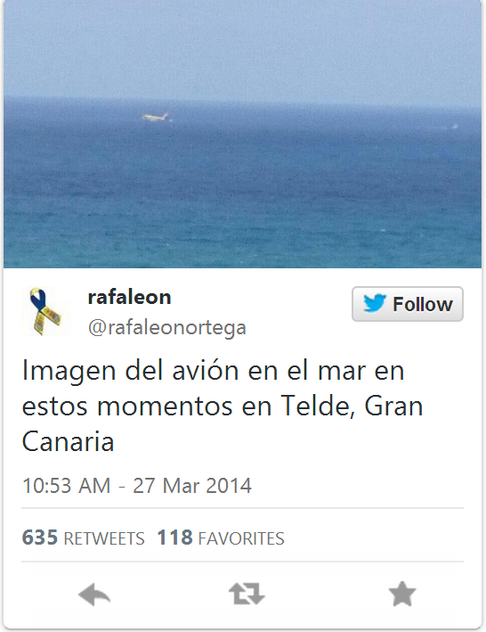
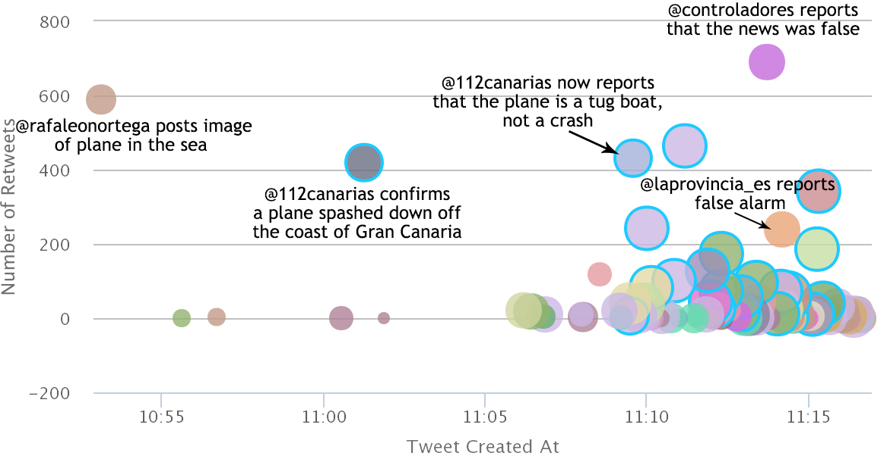
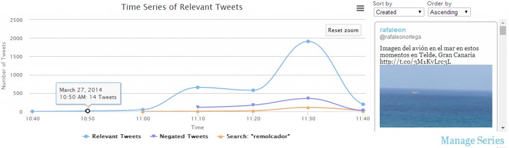
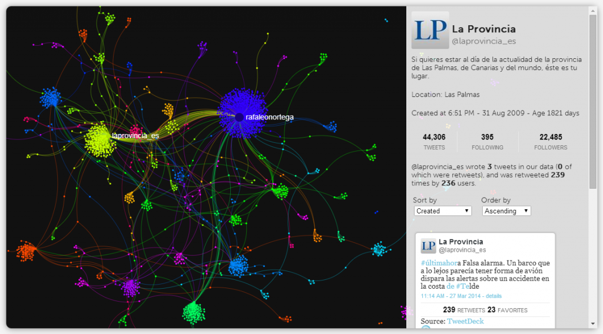
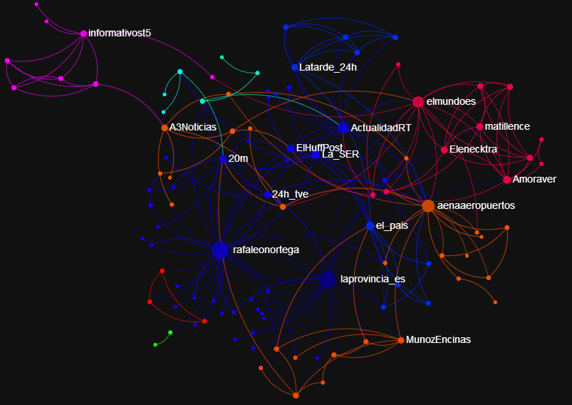

_Originally published September 17, 2014 under a previous name._

<figure>

<figcaption>

Display of a propagation tweet from the Trails Interface.

</figcaption>

</figure>

On March 27, 2014, at 10:53 AM, [@rafaleonortega](https://twitter.com/rafaleonortega) tweeted "Imagen del avión en el mar en estos momentos en Telde, Gran Canaria," or, in English, "There is a plane in the sea right now in Telde, Canary Islands." This immediately incited panic (occurring  only a few weeks after [Malaysia Airlines Flight 370](http://en.wikipedia.org/wiki/Malaysia_Airlines_Flight_370) disappeared), and thousands of users began posting about the plane in the sea on Twitter. But did a plane land in the water off the coast of the Canary Islands? We can use the Trails system to help answer that question.

[Explore this story with the Trails system!](http://twittertrails.wellesley.edu/~trails/stories/investigate.php?id=7685735)

We began collecting data about this rumor on March 27, 2014, at 12:04 PM. The search terms we used were _airplane_, _telde_, _gran canaria_ and _imagen_.  We added _avión_ after the fact, as the required keyword to filter the search results into only relevant tweets, meaning that only tweets with the term _avión_ will contribute to the visualizations we present.

### Propagation Visualization

The first visualization is the propagation graph, from which we discover some facts about how the "Plane in the Sea" story developed. Looking at the graph as a whole, we can see that the tweets, spread over only 20 minutes, are varied in content (indicated by the different colors) and number of retweets (y coordinate), and the users who have written them also vary in the number of followers they have (larger points have more followers). There is also a certain number of verified users (with blue borders), mostly news organizations.

<figure>

<figcaption>

The propagation graph, showing the tweets that were written when the story first broke on Twitter.

</figcaption>

</figure>

In this case study, the originating tweet appears as the first one in the graph.  
It also happens to be the investigative tweet, reporting at 10:53 am EST that there is a plane in the sea near Telde in the Canary Islands, with a blurry picture of what appears to be an airplane in the water. Information about the originator, the user who started the rumor by tweeting the picture of the airplane, is provided as well: [@rafaleonortega](twitter.com/rafaleonortega)'s describes himself as a sports reporter, and has a small number of followers. [@rafaleonortega](http://twitter.com/rafaleonortega) is not perhaps the most credible source for breaking news, but his tweet has almost 600 retweets, so his message has been fairly well propagated, likely due to the accompanying image.

The next few tweets have similar messages, talking about a plane crashing in the sea, including a tweet at 11:01 am from [@112canarias](http://twitter.com/112canarias), a verified account tweeting about emergency information in the Canary Islands (112 is similar to 911 in the US). This tweet confirms that a plane splashed down off the coast, though they do not know the number of passengers. However, less than ten minutes later, at 11:09 am, [@112canarias](http://twitter.com/112canarias) tweets again, now reporting that what was mistaken for a plane is actually a tugboat; at the same time, other verified accounts continue to report that a plane has crashed in the sea. Two tweets from unverified accounts ([@controladores](https://twitter.com/controladores) at 11:13 am with 690 retweets, and [@laprovincia\_es](https://twitter.com/laprovincia_es) at 11:14 am with 239 retweets) also report that the plane crash is false, while more accounts continue to report about the crash.

### Timeline Visualization

<figure>

<figcaption>

The Timeline visualization, showing three series: all the relevant tweets, the negating tweets, and those the user chose to search for containing a particular keyword: remolcador (tugboat).

</figcaption>

</figure>

The Time Series visualization gives an overview of the whole story.   Although the propagation graph shows [@rafaleonortega](https://twitter.com/rafaleonortega) breaking the story, the time series shows a tweet written four minutes earlier by [@SilviaLuzHernnd](https://twitter.com/SilviaLuzHernnd) claiming there was a plane crash, and mentioning two emergency information accounts, [@112canarias](https://twitter.com/112canarias/) (which we saw in the propagation graph) and [@Infoemergencias](https://twitter.com/Infoemergencias).

The story begins to pick up in popularity after 11:10 am, with over 500 tweets in a ten minute period.  The story peaks in popularity at 11:30 am, with almost 2,000 tweets in ten minutes.  The first mention of a tugboat can be seen at 11:09 am, preceding the negating information which claims the story of the crash is false.  Although the number of tweets negating the story never equals the number claiming it to be true, as the number of negating tweets increases, the number supporting it begins to decrease.

### Network Graphs

The network of retweeting users is shown in the first of two network visualizations.

<figure>

<figcaption>

The retweet visualization, showing the network of users who retweeted each other, and the interactive display provided by Trails.

</figcaption>

</figure>

The main actors, users who received the most retweets, appear largest and most prominent in this graph. [@rafaleonortega](https://twitter.com/rafaleonortega) appears as the most retweeted node in the graph, by 554 different users in the dataset. [@laprovincia\_es](https://twitter.com/laprovincia_es) is also highly visible, with 236 users retweeting its tweets. These two users were highlighted before in the Propagation visualization, where [@rafaleonortega](https://twitter.com/rafaleonortega) has spread the rumor of the plane crash, and [@laprovincia\_es](https://twitter.com/laprovincia_es) tweeted denying the rumor.  Note that the clusters of accounts retweeting each of these two accounts are mostly not overlapping, indicating that each group has heard either the original story or its denial.

However, there is a smaller group of accounts retweeting both [@rafaleonortega](https://twitter.com/rafaleonortega) and [@laprovincia\_es](https://twitter.com/laprovincia_es). These are the users who propagated the initial false information and then propagated its correction. Clicking on these users on the web interface reveals that they have almost all retweeted first [@rafaleonortega](https://twitter.com/rafaleonortega) and then, minutes afterwards, retweeted [@laprovincia\_es](https://twitter.com/laprovincia_es)' denial. This lends credibility to [@laprovincia\_es](https://twitter.com/laprovincia_es)' information: even though less users have retweeted him, his information that the crash was a false story was conclusive for many users.

<figure>

<figcaption>

The co-retweeted graph, highlighting users who were both retweeted by a third user.

</figcaption>

</figure>

The co-retweeted network shown in figure highlights the main actors from the retweet network, by connecting accounts based on mutual retweeting users.  That is, if User A and User B in the co-retweeted network and connected by an edge, it means at least one other user has retweeted User A and retweeted User B. [@rafaleonortega](https://twitter.com/rafaleonortega) and [@laprovincia\_es](https://twitter.com/laprovincia_es) are connected in the co-retweeted network because of the users who retweeted both of them.  Connections indicate related content: in this case the relationship is that the content created by [@laprovincia\_es](https://twitter.com/laprovincia_es) is a response and contradiction of information from [@rafaleonortega](https://twitter.com/rafaleonortega).

### Conclusion

The information that a plane had landed in the water was false.  This rumor was inspired by an image which appeared to back up the claim, so much so that verified, official emergency accounts like @112canarias posted that it was true.  However, the denial of the rumor came only minutes after it was posted, with some accounts like @112canarias correcting information they had already posted: what looked like a plane was, in fact, a tugboat (more obvious in a close up of the object):  
http://instagram.com/p/mDPzq-kaBe/  
Although the rumor continued to spread for hours after it was corrected, it eventually began to subside as the negation gained more attention.
